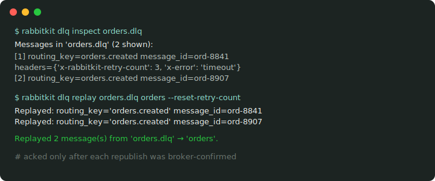

<p align="center"></p>

# rabbitkit

**RabbitMQ made enjoyable — less broker plumbing, more business logic.**

[](https://pypi.org/project/rabbitkit/)
[](https://github.com/talaatmagdyx/rabbitkit/actions/workflows/ci.yml)
[](pyproject.toml)
[](LICENSE)
[](pyproject.toml)
[](pyproject.toml)

rabbitkit is a **RabbitMQ-first toolkit for Python services**. It gives you
clean decorators, safe retries, dead-letter queues, publisher confirms,
explicit acknowledgement policies, Kubernetes-ready lifecycle hooks,
structured logging, OpenTelemetry tracing, and real in-memory testing — so
your team can focus on what each message *means*, not how the broker behaves
when things fail.

RabbitMQ is powerful. Production RabbitMQ is full of sharp edges.
rabbitkit smooths those edges **without hiding the broker from you**.

```python
from rabbitkit import AsyncBroker, RabbitConfig

broker = AsyncBroker(RabbitConfig())

@broker.subscriber(queue="orders.created")
async def handle_order(order: dict) -> None:
    await fulfill_order(order)
```

That should feel like application code. The retry topology,
acknowledgements, confirms, DLQs, shutdown behavior, and test harness should
not be rewritten in every service. **That is what rabbitkit is for.**

**Contents:** 
- [Believes](#what-rabbitkit-believes) ·
- [Why](#why-rabbitkit-exists) ·
- [Install](#installation) ·
- [Quick start](#quick-start) ·
- [Safety model](#message-safety-model) ·
- [Failure table](#what-happens-when-things-fail) ·
- [Ack policies](#acknowledgement-policies) ·
- [Production profile](#production-profile) ·
- [Observability](#observability) ·
- [DI](#dependency-injection) ·
- [Middleware](#middleware-batteries-included) ·
- [CLI](#operate-it-from-the-terminal) ·
- [Compares](#how-it-compares) ·
- [Architecture](#architecture) ·
- [Docs](#documentation)

---

## What rabbitkit believes

Most services need the same things:

- a clean way to register consumers
- safe retry behavior
- a place for poison messages to go
- publisher confirms that are **checked**
- explicit acknowledgement ownership
- graceful shutdown
- useful logs and traces
- health checks that behave correctly in Kubernetes
- tests that do not require a live broker

rabbitkit packages those concerns into one focused toolkit. The philosophy:

> **Make RabbitMQ pleasant for developers and predictable for operators.**

Developers get a clean programming model. Operators get visible message
outcomes. Production gets fewer silent failure paths.

## Why rabbitkit exists

Starting with RabbitMQ is easy: `basic_publish(...)`, `basic_consume(...)`.
Then production asks better questions:

- What happens if a handler fails *forever*?
- Where does a malformed payload go?
- Can a rejected message disappear because the queue had no DLX?
- Did the retry publish **confirm** before the original was acknowledged?
- Can a DLQ replay remove a message before the republish is confirmed?
- Can a pod shut down without interrupting in-flight work?
- Can CI test real consumer behavior without starting RabbitMQ?

rabbitkit exists for those questions. Its goal is not to turn RabbitMQ into
something else — it is to make direct RabbitMQ usage feel like good
application code: clear routing, safe defaults, explicit outcomes, real
tests, production-ready lifecycle.

**rabbitkit is:** a RabbitMQ-first toolkit · a clean consumer/publisher
API · a reliability layer over `pika` and `aio-pika` · a testing layer for
handlers · a production lifecycle layer · safety defaults for retry, DLQ,
confirms, and acks.

**rabbitkit is not:** a task queue · a scheduler · a generic event-streaming
abstraction · a replacement for understanding RabbitMQ · an exactly-once
delivery system.

---

## Installation

```bash
pip install rabbitkit[async]        # AsyncBroker (aio-pika)
pip install rabbitkit[sync]         # SyncBroker (pika)
pip install rabbitkit[all-brokers]  # both transports
pip install rabbitkit[all]          # everything optional
```

Requires Python ≥ 3.11.

## Quick start

### 1. Create a consumer

```python
from rabbitkit import RabbitConfig, AsyncBroker

broker = AsyncBroker(RabbitConfig())

@broker.subscriber(queue="orders.created")
async def handle_order(body: dict) -> None:
    print(f"order id={body['id']}")

async def main() -> None:
    await broker.start()
```

That is enough to consume messages. But production usually needs more than
"enough".

### 2. Publish — and check the outcome

```python
async def publish_order() -> None:
    outcome = await broker.publish(
        exchange="orders",
        routing_key="orders.created",
        body={"id": 42, "item": "widget"},
    )
    outcome.raise_for_status()
```

A publish can be `CONFIRMED`, `SENT`, `RETURNED`, `NACKED`, `TIMEOUT`, or
`ERROR`. Application code can treat those as different states instead of
assuming "publish called" means "message safe".

### 3. Add retry and DLQ handling

```python
from rabbitkit import RetryConfig

@broker.subscriber(
    queue="orders.created",
    exchange="orders",
    routing_key="orders.created",
    retry=RetryConfig(max_retries=3, delays=(5, 30, 120)),
)
async def handle_order_with_retry(body: dict) -> None:
    await fulfill_order(body)
```

This wires the reliability path — **broker-side**, carried in hardened
headers, surviving crashes and reconnects:

```
orders.created
  → orders.created.retry.1   (5s)
  → orders.created.retry.2   (30s)
  → orders.created.retry.3   (120s)
  → orders.created.dlq
```

Transient failures retry with backoff. Permanent failures skip the ladder
and go straight to the DLQ. Nothing disappears silently — every rejecting
route gets a DLQ by default.

### 4. Test it without RabbitMQ

```python
from rabbitkit.testing import TestBroker

def test_order_handler():
    broker = TestBroker()

    @broker.subscriber(queue="orders.created")
    def handle(body: dict) -> None:
        assert body["id"] == 42

    broker.start()
    broker.publish("orders.created", b'{"id": 42}')
    broker.stop()
```

`TestBroker` is not a mock. It runs the real routing, middleware,
serialization, dependency resolution, settlement, and ack/nack pipeline in
memory. Your CI can test RabbitMQ behavior without running RabbitMQ.

### 5. Run with FastAPI

```python
from contextlib import asynccontextmanager

from fastapi import FastAPI

from rabbitkit import RabbitConfig, AsyncBroker
from rabbitkit.fastapi import rabbitkit_lifespan

api_broker = AsyncBroker(RabbitConfig())

@api_broker.subscriber(queue="orders.created")
async def handle_order_event(body: dict) -> None:
    ...

@asynccontextmanager
async def lifespan(app: FastAPI):
    async with rabbitkit_lifespan(api_broker):
        yield

app = FastAPI(lifespan=lifespan)
```

### Sync example

```python
from rabbitkit import RabbitConfig
from rabbitkit.sync import SyncBroker

sync_broker = SyncBroker(RabbitConfig())

@sync_broker.subscriber(queue="orders.created")
def handle_order_sync(body: bytes) -> None:
    print(f"received order: {body!r}")

def run() -> None:
    sync_broker.start()
```

The sync broker fits simple workers, scripts, legacy services, and teams
that do not want an asyncio runtime. **Throughput note:** sync confirmed
publishing waits one confirm per message (~0.9k msg/s measured);
`worker_count` does not raise it. For high-throughput confirmed publishing
use `AsyncBroker` + `AsyncBatchPublisher` (pipelined confirms, ~6.1k msg/s
measured) or `SyncBatchPublisher` (pipelined confirms for sync code on a
dedicated I/O thread), or scale out across processes.

---

## Message safety model

rabbitkit is an **at-least-once** toolkit: a handler may run more than once
(crash after work but before ack, connection death mid-handler, DLQ replay,
producer retry after a confirm timeout…). rabbitkit removes dangerous
ambiguity around those cases — it does not remove the need for idempotency.

For payments, emails, tickets, webhooks, external API calls: design the
handler so running it twice is safe (idempotency keys, unique constraints,
processed-event tables, outbox patterns — or rabbitkit's deduplication
middleware, whose `store_results` mode replays the original result to
duplicates). The rule is simple:

> rabbitkit can help you retry safely. Your business logic must still be
> safe to retry.

## What happens when things fail?

| Failure mode | rabbitkit behavior |
|---|---|
| Handler raises forever | Retry ladder, then DLQ |
| Malformed payload | Classified permanent, preserved in DLQ |
| Reject with no DLX | Safe default auto-provisions a DLQ — no silent discard |
| Retry publish times out | Original is **not** acked as if the retry succeeded |
| DLQ replay publish fails | DLQ message is **not** removed as if replay succeeded |
| Message unroutable | Mandatory publishing returns a distinct `RETURNED` outcome |
| Broker blips | Readiness changes; liveness does **not** kill the pod |
| Pod gets SIGTERM | Consumers stop first, in-flight work drains |
| CI has no RabbitMQ | `TestBroker` runs the real pipeline in memory |

## Acknowledgement policies

Settlement is a decision, not a side effect hidden in a callback.

| Policy | Behavior | Use case |
|---|---|---|
| `AUTO` | Ack on success, retry/reject on failure | Most consumers |
| `MANUAL` | Handler owns ack/nack/reject | Custom settlement flows |
| `NACK_ON_ERROR` | Ack on success, nack on failure | Never silently accept failed work |
| `ACK_FIRST` | Ack before the handler runs | At-most-once workloads |

`ACK_FIRST` can lose messages if the handler fails after the ack — use it
only when loss is acceptable.

## Production profile

The recommended baseline (see the
[production checklist](docs/production/checklist.md)): quorum queues (+
`delivery_limit`), per-queue retry/DLQ topology, publisher confirms on,
mandatory publishing where routing matters, checked `PublishOutcome`s,
explicit ack policies, structured logs, split readiness/liveness probes,
management-API metrics for queue depth and consumer lag, idempotent
handlers. Migrating existing classic queues to quorum? There's a tool:
`rabbitkit topology migrate` ([guide](docs/quorum-migration.md)).

## Observability

Structured logs carry message context (`message_id`, `correlation_id`,
routing, queue, handler, retry count, settlement, duration, error type) with
secret redaction on by default. Metrics cover consumed/acked/nacked/
retried/dead-lettered counts, publish outcomes, handler latency,
redeliveries, reconnects, and — via the management API poller — queue depth
and consumer lag. Tracing is standard OpenTelemetry
(`pip install rabbitkit[otel]`): W3C context propagation over AMQP headers,
one continuous trace from publish to consume.

## Advanced & experimental

**Advanced stable** (enable deliberately): publish-side backpressure
(`FlowController`), batch publishing/acking, pipelined sync confirms
(`SyncBatchPublisher`), DLQ inspector + replay CLI, management API client,
topology validation/drift/migration CLI, health watcher, circuit-breaker
middleware (bring any `CircuitBreakerProtocol` implementation, e.g.
pybreaker).

**Experimental** (may change without a deprecation cycle — read the
[stability policy](docs/stability-policy.md)): RPC over direct reply-to,
distributed locking, message signing, result backends, stream queues, the
monitoring dashboard. Notable caveats: the default signing nonce cache is
per-process (use a shared cache for real replay protection), and never
expose the dashboard publicly without authentication.

## Dependency injection

Handlers resolve request-like context declaratively — typed body, headers,
routing-key segments, and shared dependencies:

```python
from rabbitkit import AsyncBroker, Context, Depends, Header, Path, RabbitConfig
from rabbitkit.core.message import RabbitMessage

di_broker = AsyncBroker(RabbitConfig())

def get_db() -> str:
    return "db-connection"

@di_broker.subscriber(queue="tenants.{tenant_id}.orders")
async def handle_tenant_order(
    body: dict,
    tenant_id: str = Path(),
    trace_id: str = Header("x-trace-id", default=""),
    db: str = Depends(get_db),
    message: RabbitMessage = Context(),
) -> None:
    ...
```

Serialization is pluggable per route: raw bytes, JSON (default), Pydantic
models, msgspec structs, or a custom parser/decoder pipeline — annotate the
body parameter with the type you want and pick the serializer that
validates it.

## Middleware, batteries included

| Middleware | Job |
|---|---|
| `RetryMiddleware` | Broker-side retry ladder (auto-wired with `retry=`) |
| `DeduplicationMiddleware` | Redis-backed duplicate suppression; `claim` policy is crash-safe; `store_results` replays the original answer to duplicates |
| `MetricsMiddleware` | Counters + latency histograms, cardinality-guarded labels |
| `OTelTracingMiddleware` | Standard OpenTelemetry spans + W3C propagation |
| `CompressionMiddleware` | gzip/zstd with streaming zip-bomb guards |
| `RateLimitMiddleware` | Token-bucket consume throttling (nack/drop/wait) |
| `TimeoutMiddleware` | Per-handler deadlines, retry-classified |
| `CircuitBreakerMiddleware` | Wraps any `CircuitBreakerProtocol` implementation |
| `SigningMiddleware` | HMAC signing + replay protection (experimental) |

## Operate it from the terminal

```bash
rabbitkit run myapp.main:broker                   # run consumers
rabbitkit dlq inspect orders.dlq                  # peek at poison messages
rabbitkit dlq replay orders.dlq orders --reset-retry-count
rabbitkit topology validate myapp.main:broker     # declared vs live drift
rabbitkit topology migrate myapp.main:broker      # classic -> quorum, planned & resumable
rabbitkit health myapp.main:broker
```

The DLQ replay acks a message only after its republish is broker-confirmed —
the recovery tool cannot itself lose messages.

<p align="center"></p>

## How it compares

- **Raw `pika` / `aio-pika`** — rabbitkit is a reliability layer *on top of*
  them, not a replacement; drop to the underlying client any time.
- **Celery / task queues** — rabbitkit is messaging, not a task framework:
  no scheduler, no result-store-first model, RabbitMQ stays visible.
- **FastStream** — a great multi-broker, async-first framework. Choose it
  for broker portability and its ecosystem; choose rabbitkit for
  RabbitMQ-only depth: broker-side retry state, auto-DLX defaults, checked
  publish outcomes, DLQ replay tooling, and a sync transport.

## Architecture

```
rabbitkit/
  core/                 # route registry, topology, pipeline, settlement, config
  sync/                 # pika adapter (+ SyncBatchPublisher)
  async_/               # aio-pika adapter (+ AsyncBatchPublisher)
  middleware/           # retry, dedup, metrics, otel, compression, rate limit…
  serialization/        # JSON, msgspec, Pydantic, parser/decoder pipeline
  di/                   # Depends, Header, Path, Context
  testing/              # TestBroker and friends
  highload/             # FlowController, BatchPublisher, BatchAcker
  cli/                  # dlq, topology, migrate, health, run, shell
  fastapi.py            # FastAPI lifespan integration
```

The shared core has **zero** imports from `pika` or `aio-pika` — both
transports are adapters over the same registry, pipeline, topology model,
and settlement rules.

## Compatibility

Python ≥ 3.11 (tested: 3.11 / 3.12 / 3.13) · RabbitMQ ≥ 3.12 recommended ·
`pika >= 1.3, < 2.0` · `aio-pika >= 9.1, < 10.0`

## Documentation

- [Getting Started](docs/guide/getting-started.md) ·
- [Full Guide](docs/guide/full-guide.md) ·
- [Message Safety](docs/message-safety.md) ·
- [Retry & DLQ](docs/retry-and-dlq.md) ·
- [Production Checklist](docs/production/checklist.md) ·
- [Idempotency Contract](docs/production/idempotency.md) ·
- [Kubernetes](docs/kubernetes.md) ·
- [Quorum Migration](docs/quorum-migration.md) ·
- [Security](docs/security.md) ·
- [Stability Policy](docs/stability-policy.md) ·
- [Troubleshooting](docs/troubleshooting.md)

## Contributing & security

See [CONTRIBUTING.md](CONTRIBUTING.md) for local development and quality
gates (ruff, `mypy --strict`, near-total test coverage — the bar is real).
Found a vulnerability? Follow [SECURITY.md](SECURITY.md) and report it
privately.

## License

[MIT](LICENSE)
